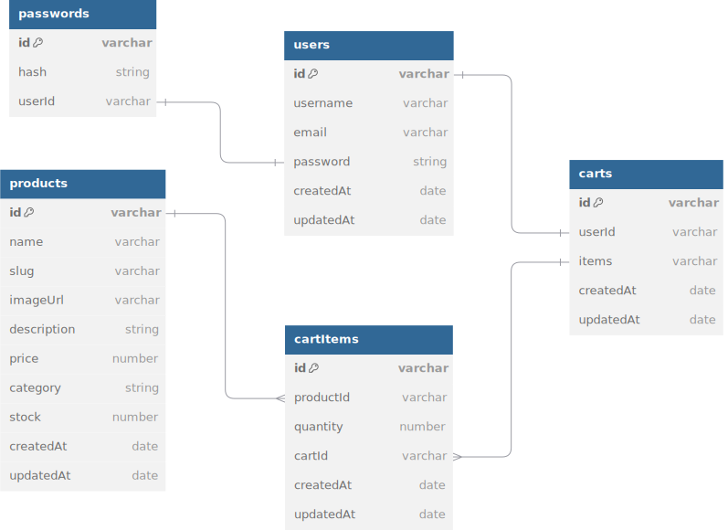

# Trust

[Trust](www.trust.com) is an online store for automotive sparepart.
We sell quality good producs from trusted companies and have collaborated with more than 4 international spare parts manufacturers.
Our job is to mediate between you and the manufacturer in transactions, and prioritize your trust above everything else.
Therefore we named this platform is **TRUST** (In English).

Table of Contents:

- [Trust](#Trust)
  - [Links](#links)
  - [Features](#features)
  - [UI Designs](#ui-designs)
    - [Home Page](#home-page)

## Links

- Website/Frontend: <https://trust.farhan.dev>
  - Backend: <https://trust-backend.farhan.dev>
- Repositories:
  - General: <https://github.com/aan-cloud/trust>
  - Backend: <https://github.com/aan-cloud/trust-backend>
  - Frontend: <https://github.com/aan-cloud/trust-frontend>

Inspirations:
- <https://saiko.com.my/>
- <https://remco.com.my/>
- <https://www.eraspares.com/>

## Features

- Home page
  - Hero section
  - Products catalogue. Example: <https://saiko.com.my/auto-parts-supplier-malaysia>
- Product page
  - Image
  - SKU (stock keeping unit)
  - Name
  - Price
  - Description
  - Add to cart form: add to cart button
- Shopping cart page
  - Product items to buy
    - Image, name, price, quantity, total (price x quantity)
    - Remove item
  - Link: continue shopping, go to products catalogue
  - Link: checkout
- Checkout page
  - On WhatsApp: Generate transaction format form.

## UI Designs

- Figma: <https://www.figma.com/design/3ijGGTIKpevl9sPWqlcJGM/Trust?node-id=0-1&t=0BYMeZt73WgfDr1f-1>

### Home Page


## Entity Relationship Diagram (ERD)



## REST API Endpoints

- Production: `https://trust.farhan.dev`
- Local: `http://localhost:3000`

| Endpoint         | HTTP     | Description               |
| ---------------- | -------- | ------------------------- |
| `/products`      | `GET`    | Get all products          |
| `/products/:id`  | `GET`    | Get product by id         |
| `/products/seed` | `POST`   | Seed all initial products |
| `/products`      | `POST`   | Add new product           |
| `/products`      | `DELETE` | Delete all products       |
| `/products/:id`  | `DELETE` | Delete product by id      |
| `/products/:id`  | `PATCH`    | Update product by id    |

### Product

```json
{
  "id": "abc123",
  "name": "Tire Super",
  "slug": "tire-super",
  "imageUrl": "http://image.com",
  "manufacturer": "toyota",
  "description": "Very strong Tire for racing",
  "price": 2000,
  "category": "Tire",
  "stock": 100,
  "createdAt": "23-11-2023",
  "updatedAt": "26-12-2023"
}
```

### Add New Product

Request Body:

```json
{
  "name": "Tire Super",
  "slug": "tire-super",
  "imageUrl": "http://image.com",
  "manufacturer": "toyota",
  "description": "Very strong Tire for racing",
  "price": 2000,
  "category": "Tire",
  "stock": 100,
}
```

Response Body:

```json
{
  "name": "Tire Super",
  "slug": "tire-super",
  "imageUrl": "http://image.com",
  "manufacturer": "toyota",
  "description": "Very strong Tire for racing",
  "price": 2000,
  "category": "Tire",
  "stock": 100,
}
```